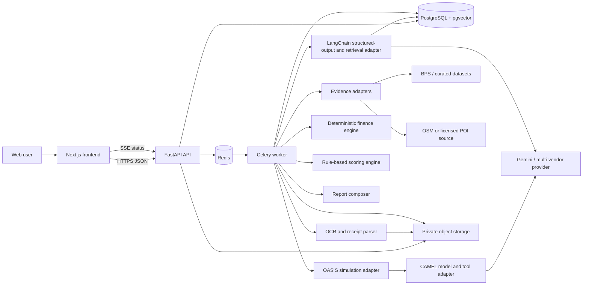
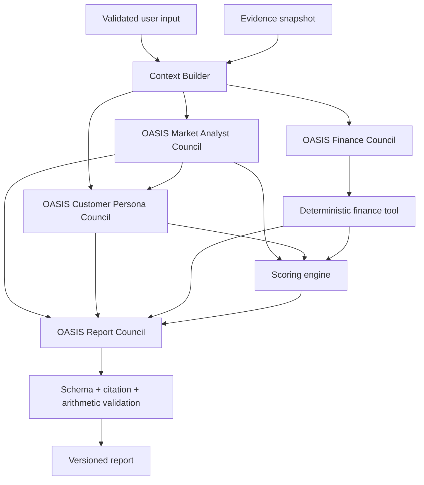
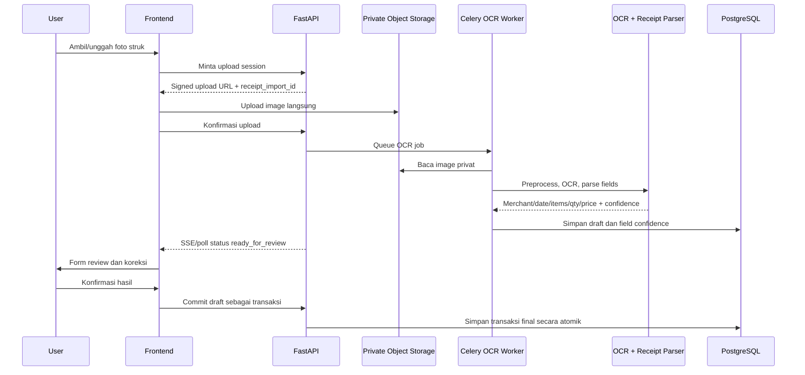

# Arsitektur Sistem

## Tujuan arsitektur

Arsitektur memisahkan fakta, simulasi, perhitungan, dan narasi. Pemisahan ini membuat hasil dapat diuji, AI dapat gagal tanpa menjatuhkan seluruh sistem, serta juri dapat melihat dengan jelas di mana OASIS memberi nilai.

## Container view



## Analysis dependency graph



Market Analyst, Customer Persona, dan Finance Council dapat memulai subtask yang dependency-nya sudah tersedia. Report Agent baru menyintesis setelah artifact ketiganya dan hasil scoring tersedia atau eksplisit berstatus gagal.

## Bounded contexts

| Context | Tanggung jawab | Tidak boleh dilakukan |
|---|---|---|
| Identity | User, session, consent | Menyimpan password plaintext |
| Education | Content version, progress, quiz | Membuat hukum/perizinan dari prompt bebas |
| Business Profile | Jenis, lokasi, produk, asumsi biaya | Menentukan score |
| Evidence | Fetch, normalize, provenance, quality | Mengubah data source tanpa versioning |
| Agent Engine | Empat agent type, personality council, scenario, OASIS run, dan trace | Membypass deterministic tools untuk angka otoritatif |
| Finance | HPP, margin, BEP, payback, scenario | Memakai angka buatan LLM |
| Scoring | Rule evaluation dan breakdown | Menyembunyikan rule version |
| Reporting | Merge artifact, narrative, PDF | Membuat angka baru yang tak ada di artifact |
| Transaction | Product, transaksi manual/batch/foto, OCR review, aggregate, insight | Menyimpan hasil OCR sebagai transaksi final tanpa konfirmasi |

## AI framework boundary

- **OASIS** mengelola empat agent type, personality instances, AgentGraph, persona social environment, actions, structured interview, interaction rounds, dan trace.
- **CAMEL-AI** menjadi model/tool interface yang dipakai OASIS agent untuk Gemini dan provider lain.
- **LangChain** menangani structured-output parser, reusable prompt chain di luar social interaction loop, document loader/retrieval adapter, dan provider fallback workflow yang diperlukan application service.
- **pgvector** berada pada PostgreSQL yang sama untuk embedding/index knowledge content; metadata, source, version, dan access scope tetap disimpan relational.
- Tidak ada framework yang boleh menghitung finance atau score melalui generasi teks; keduanya memanggil deterministic engines.

## Jalur request Market Analysis

1. API memvalidasi input, consent, education prerequisite, dan idempotency key.
2. API membuat `analysis_run` berstatus `queued`, menyimpan snapshot input, lalu mengirim job.
3. Worker membangun evidence snapshot. Setiap field memiliki source, observed-at, dan quality.
4. OASIS adapter membentuk personality council untuk Market Analyst, Customer Persona, dan Finance Agent.
5. Agent graph menjalankan structured deliberation dan simulasi konsumen; application orchestrator selalu menjalankan deterministic finance tool lalu memberikan hasilnya kepada Finance Council.
6. Extractor mengubah trace menjadi typed artifacts; raw prose bukan input langsung score.
7. Finance tool dan scoring engine menghitung hasil berdasarkan versioned rules.
8. OASIS Report Council menyusun, mengkritik, dan merevisi narasi hanya dari artifact terstruktur.
9. Validator memeriksa JSON schema, citation coverage, forbidden claims, dan arithmetic consistency.
10. Job menjadi `completed`, `partial`, atau `failed`; frontend mendapat event status.

## Jalur input foto struk



Foto struk adalah input MVP. Hasil OCR selalu menjadi draft; pengguna wajib dapat mengoreksi nama produk, jumlah, harga, tanggal, dan total sebelum commit. Image divalidasi berdasarkan MIME sebenarnya, ukuran, resolusi, dan malware policy; EXIF dibuang jika tidak dibutuhkan.

## State machine

```text
queued
  -> collecting_evidence
  -> building_context
  -> simulating
  -> calculating_finance
  -> scoring
  -> composing_report
  -> validating_report
  -> completed | partial | failed | cancelled
```

Import foto struk memakai state machine terpisah:

```text
created -> uploading -> queued -> preprocessing -> extracting
  -> ready_for_review -> confirmed -> committed
  | failed | cancelled
```

Status `partial` dipakai bila deterministic report tersedia tetapi komponen non-esensial seperti OASIS atau PDF gagal. Jangan menyamarkan partial menjadi completed.

## Storage strategy

### PostgreSQL

System of record untuk user, profile, content progress, transactions, analysis metadata, evidence snapshots, rule versions, structured results, dan audit events.

### OASIS SQLite trace

OASIS secara default menulis interaction trace ke SQLite. Perlakukan file ini sebagai artifact per run:

- gunakan path unik, bukan file global;
- jangan delete file lama secara implisit seperti contoh quick-start;
- upload artifact atau extract row penting setelah run;
- simpan hash, retention, dan access control;
- cleanup melalui retention job yang eksplisit.

Untuk MVP, jangan memodifikasi OASIS agar langsung memakai PostgreSQL kecuali spike membuktikan kebutuhan. Adapter menjaga boundary dan menghindari fork besar.

### Redis

Broker/result backend job dan cache jangka pendek. Jangan jadikan Redis system of record atau tempat menyimpan report final.

### Object storage

PDF dan trace artifact. Pada server fakultas dapat berupa S3-compatible storage atau volume terkontrol; URL download harus signed dan terbatas waktu.

## Reliability patterns

- Idempotency key untuk pembuatan analysis dan export.
- Timeout terpisah per data provider dan LLM call.
- Retry hanya untuk error transient; schema/policy error tidak diulang tanpa perubahan.
- Circuit breaker untuk provider eksternal.
- Hard budget per run: jumlah persona, round, concurrent call, token, dan durasi.
- Fallback deterministic report bila OASIS gagal.
- Progress berdasarkan state nyata, bukan timer palsu.
- Correlation ID dari API hingga Celery, OASIS trace, dan report.

## Deployment MVP

```text
Reverse proxy / TLS
  - frontend container
  - API container
  - worker container
  - PostgreSQL
  - Redis
  - artifact volume/object store
```

Pisahkan worker dari API agar simulasi tidak memblokir request web. Jalankan minimal health check, database backup, secret injection, log rotation, dan disk monitoring. OASIS membuat log/file lokal; volume dan retention harus dirancang agar disk VM tidak penuh.

## Observability minimum

- request/job success rate dan duration p50/p95;
- time per pipeline stage;
- LLM request, token, cost estimate, timeout, dan schema failure;
- persona/round count per run;
- evidence source success, freshness, dan coverage;
- score rule version dan report prompt version;
- queue depth dan oldest-job age;
- transaction write error dan PDF generation error.

Log tidak boleh berisi password, JWT, API key, atau raw transaction detail yang tidak diperlukan.
