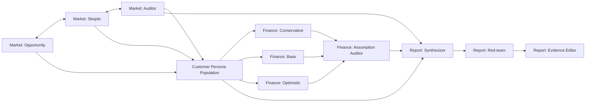

# Arsitektur Agent OASIS

## Model mental yang tepat

Ada tiga level berbeda:

1. **Role/type** — empat tanggung jawab konseptual: Market Analyst, Customer Persona, Finance, Report.
2. **Agent instance/personality** — beberapa instance di dalam sebuah role dengan perspektif dan constraints berbeda.
3. **Council/reducer** — protokol untuk menggabungkan perbedaan pendapat menjadi artifact terstruktur.

Dengan model ini, “agent bertarung di dalam dirinya” dijelaskan sebagai **beberapa instance dalam satu role melakukan structured adversarial deliberation**. Mereka bukan kepribadian acak; setiap instance memiliki mandate, evidence scope, tool access, output schema, dan stopping rule.

## Batas OASIS

OASIS menyediakan environment, social agents, graph, action space, recommendation dynamics, concurrency control, dan trace. Pada commit yang diaudit (`bb0e1a87d8c1e6447a737775d4362b6d5695032b`, package `0.2.5`), profil/prompt dapat dikustomisasi melalui `SocialAgent`, `UserInfo`, dan `TextPrompt`; model dapat berbeda per agent; `PURCHASE_PRODUCT` tersedia; `INTERVIEW` dijalankan manual oleh orchestrator.

SimuMarket AI tidak menggunakan kemampuan “hingga satu juta agent” untuk MVP. Referensi resmi OASIS menunjukkan konsumsi token meningkat dengan jumlah agent, activation probability, dan time step. Nilai teknis MVP datang dari controlled interaction dan traceability, bukan skala maksimum.

## Empat role inti

### Market Analyst Council

Tujuan: mengubah evidence lokal menjadi beberapa interpretasi yang saling mengkritik.

| Personality | Mandate | Guardrail |
|---|---|---|
| Opportunity Scout | Mencari gap kategori, waktu, dan positioning | Tidak boleh mengabaikan missing data |
| Competition Skeptic | Mencari saturation, substitusi, dan entry barrier | Tidak boleh menyimpulkan tanpa evidence ID |
| Evidence Auditor | Memeriksa freshness, coverage, dan konflik sumber | Tidak memberi rekomendasi pemasaran |

Output council adalah `MarketEvidenceAssessment`, bukan score final.

### Customer Persona Council

Tujuan: menguji respons heterogen terhadap konsep, harga, kanal, dan pesan.

Contoh archetype awal—harus dikalibrasi melalui wawancara:

| Archetype | Variasi personality/need state |
|---|---|
| Budget-driven | memprioritaskan keterjangkauan, kejelasan porsi, dan nilai yang diterima |
| Convenience-driven | memprioritaskan kecepatan layanan, kemudahan akses, dan kanal pemesanan |
| Quality-driven | memprioritaskan kualitas produk, konsistensi, dan proposisi nilai |
| Social/family-driven | memprioritaskan kecocokan untuk makan bersama dan kebutuhan kelompok |

Setiap archetype memiliki beberapa instance dengan kombinasi budget, occasion, channel preference, price sensitivity, novelty seeking, dan evidence-backed location context. Jangan menyamakan demografi dengan perilaku atau membuat stereotype etnis/agama.

Output council adalah distribusi respons: purchase-intent proxy, price objection, need-fit, channel preference, alasan, disagreement, dan uncertainty.

### Finance Council

Tujuan: stress-test asumsi, bukan menghitung dengan bahasa natural.

| Perspective | Fungsi |
|---|---|
| Conservative | Memilih bound biaya tinggi/volume rendah yang diizinkan input |
| Base | Menggunakan asumsi tengah yang eksplisit |
| Optimistic | Memilih bound biaya rendah/volume tinggi yang masih masuk akal |

Orchestrator selalu memanggil fungsi finance yang sama untuk bound minimum, dasar, dan maksimum sebelum council berjalan. Output numerik dapat direproduksi tanpa LLM; Finance Agent menggunakan LLM untuk mengkritik trade-off, membandingkan skenario, dan menandai asumsi rapuh tanpa mengubah hasil calculator. Boundary ini ditetapkan di [ADR-004](adr/ADR-004-orchestrator-owned-deterministic-tools.md).

### Report Council

Tujuan: membuat report koheren tanpa menciptakan fakta baru.

| Personality | Urutan |
|---|---|
| Synthesizer | Menyusun draft dari artifact terstruktur |
| Red-team Reviewer | Mencari overclaim, konflik, missing caveat, dan rekomendasi tak didukung |
| Evidence Editor | Memperbaiki draft dan memastikan setiap klaim memiliki provenance |

Report council berjalan sekuensial. Hanya output yang lolos validator menjadi report final.

## Implementasi seluruh agent di atas OASIS

Keempat role adalah agent inti berbasis OASIS. Customer Persona memakai social environment dan action loop penuh. Market, Finance, dan Report tetap `SocialAgent` di `AgentGraph`, tetapi melakukan structured deliberation melalui manual `INTERVIEW` dan typed artifact handoff. Deterministic tool dimiliki application orchestrator agar pelaksanaannya tidak bergantung pada keputusan model.

| OASIS agent type | Personality instances | OASIS interaction | Data/tool boundary |
|---|---|---|---|
| Market Analyst | Opportunity Scout, Competition Skeptic, Evidence Auditor | Sequential assessment, challenge, revision melalui `INTERVIEW` | Evidence snapshot disiapkan adapter dan hanya metric yang tersedia boleh dirujuk |
| Customer Persona | Budget, convenience, quality, social/family variants | Observe, comment, like/dislike, purchase, interview | Concept card dan context yang sudah disanitasi |
| Finance | Conservative, Base, Optimistic, Assumption Auditor | Sequential critique dan comparison melalui `INTERVIEW` | Tiga hasil deterministic calculator wajib disiapkan orchestrator |
| Report | Synthesizer, Red-team Reviewer, Evidence Editor | Sequential draft, red-team, revision melalui `INTERVIEW` | Typed artifact diberikan orchestrator; validator berjalan setelah output |

Semua instance dibuat sebagai `SocialAgent` atau adapter subclass yang tetap berada dalam `AgentGraph`, menggunakan custom profile, prompt template, model configuration, dan action allowlist. OASIS trace menyimpan social action dan interview. Pemanggilan deterministic engine disimpan sebagai application audit artifact dengan correlation ID yang sama.

## Topologi agent graph



Graph menggambarkan dependency komunikasi. Worker tetap dapat menjalankan action independen secara concurrent, tetapi Report Council menunggu artifact upstream agar tidak menyusun laporan kosong.

## Agent contract

Setiap instance wajib memiliki:

```yaml
agent_id: persona-budget-01
role: customer_persona
archetype: budget_driven
profile_version: persona-v1
model_profile: gemini-low-cost-v1
objectives:
  - evaluate_offer_for_current_meal_occasion
constraints:
  - use_only_observed_stimulus_and_profile
  - never_claim_to_be_a_real_customer
available_actions:
  - create_comment
  - like_post
  - dislike_post
  - purchase_product
  - do_nothing
output_schema: customer_response-v1
```

Role tidak boleh mengakses tool yang tidak dibutuhkan. Customer persona tidak mendapat database transaksi mentah; Report tidak mendapat secret/provider key; Finance Agent tidak dapat mengubah hasil deterministic calculator.

## Deliberation protocol

```text
Round 0: independent assessment
Round 1: observe anonymized positions and challenge one assumption
Round 2: controlled intervention (price/message/channel variant)
Round 3: private interview and final structured ballot
Reducer: aggregate distribution, disagreement, and evidence-linked reasons
```

Independent assessment sebelum social exposure mencegah herd effect menghapus preferensi awal. Hasil sebelum dan sesudah exposure disimpan agar influence dapat diamati, bukan disembunyikan.

## Memory dan isolation

- Satu analysis run memakai environment dan database trace unik.
- Persona tidak membawa memory lintas user atau lintas business scenario.
- Jika dua skenario dibandingkan, gunakan cohort template, prompt version, model config, dan seed yang sama sejauh memungkinkan.
- Jangan memasukkan nama pelanggan, nomor telepon, atau raw receipt ke prompt.
- Interview result adalah data sintetis dan selalu diberi label demikian.

## Structured outputs

Jangan mengagregasi prose bebas langsung. Ekstrak setiap ballot menjadi schema:

```json
{
  "agent_id": "persona-budget-01",
  "scenario_id": "scenario-a",
  "choice": "consider",
  "purchase_probability_band": "medium",
  "acceptable_price_band": {"min": 15000, "max": 20000, "currency": "IDR"},
  "top_reasons": ["near_workplace", "price_is_borderline"],
  "top_objection": "portion_unclear",
  "confidence": "low"
}
```

Probability band di atas adalah ekspresi agent sintetis, bukan probabilitas dunia nyata. Reducer menghitung distribusi dan ketidakpastian, bukan mengubahnya menjadi forecast omzet.

## Guardrails

- Prompt injection dari nama bisnis, deskripsi produk, atau evidence diperlakukan sebagai data, bukan instruksi.
- Output wajib schema-validated; kegagalan berulang menjadi `partial`.
- Agent tidak boleh mengarang competitor count, pendapatan, atau aturan hukum.
- Semua rekomendasi report harus menunjuk artifact ID.
- Hard limit jumlah persona, round, token, concurrency, wall-clock, dan retry.
- Simpan model/provider version karena alias model dapat berubah.

## Kenapa ini bukan sekadar chatbot

Sistem menjalankan cohort heterogen di environment yang sama, mengamati state, melakukan action terbatas, menerima intervensi terkontrol, meninggalkan trace, dan diwawancarai pada akhir run. Hasil kemudian direduksi bersama disagreement dan uncertainty. Chatbot tunggal biasanya hanya menghasilkan satu jawaban dari satu prompt tanpa population structure, interaction trace, atau controlled counterfactual.
