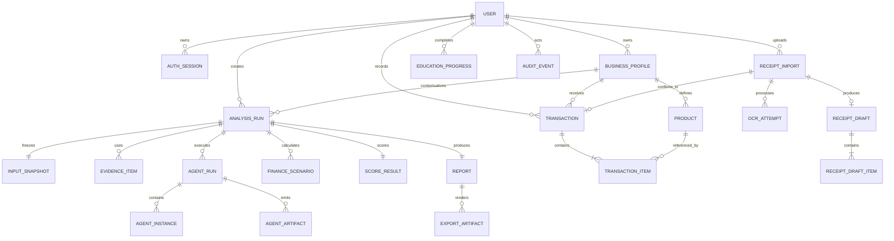

# Database dan Storage Design

## Storage roles

- PostgreSQL adalah system of record.
- `pgvector` menyimpan embedding knowledge content dan metadata retrieval pada database yang sama.
- Redis menyimpan queue/cache sementara, bukan data bisnis final.
- Private object storage menyimpan foto struk, raw OCR artifact, OASIS trace database, dan PDF export.
- OASIS SQLite dibuat unik per run lalu diregistrasikan sebagai artifact; structured result disalin ke PostgreSQL.

## Core ERD



## Analysis tables

### `analysis_runs`

```text
id uuid PK
user_id uuid FK
business_profile_id uuid FK
status enum
current_stage enum
input_snapshot_id uuid
evidence_snapshot_version text
oasis_version text
camel_version text
model_manifest jsonb
prompt_manifest jsonb
rule_set_version text
correlation_id uuid
idempotency_key text
created_at/started_at/completed_at timestamptz
failure_code text nullable
```

Unique constraint `(user_id, idempotency_key)` mencegah run ganda.

### `agent_runs` dan `agent_instances`

Satu `analysis_run` dapat memiliki council run untuk `market_analyst`, `customer_persona`, `finance`, dan `report`. Instance menyimpan personality ID/version, model config, allowed actions/tools, activation order, token usage, duration, dan outcome.

Raw conversation/action trace tidak diduplikasi penuh ke relational table. Simpan typed artifact dan pointer ke trace object beserta checksum.

### `agent_artifacts`

```text
id uuid PK
analysis_run_id uuid FK
agent_run_id uuid FK
artifact_type text
schema_version text
payload jsonb
source_artifact_ids uuid[]
validation_status enum
checksum text
created_at timestamptz
```

Artifact type minimum: `MarketAssessment`, `CustomerSimulationResult`, `FinanceScenarioResult`, `ScoreResult`, `ReportDraft`, dan `ReportReview`.

## Transaction and receipt tables

### `transactions`

```text
id uuid PK
user_id uuid FK
business_profile_id uuid FK
receipt_import_id uuid nullable FK
occurred_at timestamptz
channel enum
gross_total_idr bigint
source enum(manual,batch,receipt_ocr)
client_reference text nullable
created_at/updated_at timestamptz
```

Unique constraint `(user_id, client_reference)` ketika reference tidak null.

### `receipt_imports`

```text
id uuid PK
user_id uuid FK
business_profile_id uuid FK
status enum
object_key text
sha256 text
mime_type text
size_bytes bigint
upload_expires_at timestamptz
confirmed_transaction_id uuid nullable
created_at/updated_at/confirmed_at timestamptz
failure_code text nullable
```

### `ocr_attempts`

Simpan OCR engine/model version, preprocessing version, duration, raw-text artifact key, structured extraction JSON, aggregate confidence, dan error code. Retry membuat row baru; row lama tidak dioverwrite.

### `receipt_drafts`

Draft menyimpan merchant, tanggal, subtotal, tax/service/discount, total, currency, version, dan `updated_by`. Setiap koreksi meningkatkan version untuk optimistic concurrency.

`receipt_draft_items` menyimpan raw name, normalized name, matched product ID, quantity, unit price, line total, confidence per field, dan correction flags.

## Education and vector tables

- `education_modules`: topic, business-type mapping, content version, reviewed_at, published status.
- `education_progress`: user, module version, started/completed time, quiz result.
- `knowledge_documents`: source, version, chunk metadata, access scope, content hash.
- `knowledge_embeddings`: document/chunk FK, embedding model/version, `vector`, created_at.

Progress menunjuk module version agar penyelesaian lama tetap dapat diaudit ketika content berubah.

## Indexes and partition candidates

- `transactions(business_profile_id, occurred_at desc)`.
- `transaction_items(product_id, transaction_id)`.
- `analysis_runs(user_id, created_at desc)` dan partial index untuk active status.
- `agent_artifacts(analysis_run_id, artifact_type)`.
- `evidence_items(geography_id, metric, observed_at desc)`.
- `receipt_imports(user_id, status, created_at desc)`.
- HNSW/IVFFlat pgvector index hanya setelah ukuran dan query pattern terukur.

Partition transaksi belum diperlukan pada skala MVP; desain kolom waktu dan tenant key disiapkan agar partitioning dapat ditambahkan tanpa mengubah API.

## Consistency rules

- Commit receipt draft menjadi transaction dilakukan dalam satu database transaction.
- Total transaksi dihitung backend dari items dan direkonsiliasi terhadap total struk.
- Completed report tidak diubah in-place; revisi membuat version baru.
- Rule/prompt/model/evidence version selalu disimpan pada run.
- Soft delete tidak menggantikan privacy deletion; purge job menghapus data dan object sesuai retention.
- Foreign key dan tenant ownership diverifikasi pada service/repository layer serta test lintas user.

