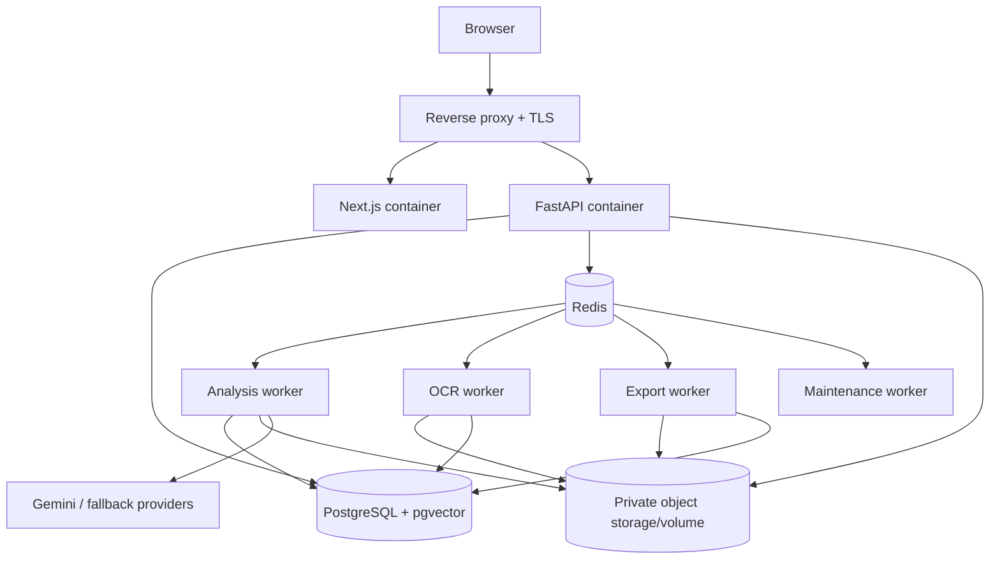

# Deployment dan Observability

## VM topology



API tidak menjalankan OASIS, OCR, atau PDF generation di request thread. Worker dipisahkan per queue agar foto besar atau simulasi lambat tidak menahan transaksi biasa.

## Worker queues

| Queue | Task | Concurrency policy |
|---|---|---|
| `analysis` | Evidence, empat OASIS councils, scoring, report | Rendah dan dibatasi token/provider semaphore |
| `ocr` | Image preprocessing, OCR, parsing, product matching | Dipisah berdasarkan CPU/GPU capacity |
| `export` | Market/transaction PDF | CPU/memory bounded |
| `maintenance` | Retention, cleanup, refresh evidence, reconciliation | Scheduled dan rate-limited |

Celery task harus idempotent pada boundary stage. Retry memakai exponential backoff dan hanya untuk error transient.

## Dependency pinning

- Python dependency dikunci dengan lockfile.
- Baseline audit OASIS: package `0.2.5`, commit `bb0e1a87d8c1e6447a737775d4362b6d5695032b`, CAMEL-AI `0.2.78`.
- Node dependency memakai lockfile dan CI frozen install.
- Docker image memakai digest/tag immutable untuk release.
- Prompt, model routing, finance rules, scoring rules, OCR preprocessing, dan parser memiliki version sendiri.

## Configuration groups

```text
APP_*                 runtime environment, public URLs
DATABASE_*            PostgreSQL connection and pool
REDIS_*               broker/cache
AUTH_*                signing keys, access/refresh TTL
OBJECT_STORAGE_*      bucket/endpoint/credentials/retention
LLM_*                 Gemini and fallback provider keys/models/budgets
OASIS_*               package/config, concurrency, rounds, trace path
OCR_*                 engine/model, max upload, confidence thresholds
CELERY_*              queue, retry, timeout
OBSERVABILITY_*       log, metrics, trace exporter
```

Secret disuntikkan saat runtime dan tidak masuk source, image, build log, atau frontend bundle.

## Health and readiness

- `/health/live`: process hidup, tanpa dependency call mahal.
- `/health/ready`: database dan Redis dapat diakses, migration sesuai.
- Worker heartbeat per queue.
- Provider eksternal dilaporkan sebagai degraded, bukan membuat API unready.
- Disk/object capacity dan OASIS trace directory dimonitor.

## Metrics minimum

### API

- request count/error/duration per route;
- auth failure dan rate-limit count;
- active DB connection dan pool wait;
- upload size serta rejected upload.

### Analysis/OASIS

- queue age, run duration per stage;
- active personality instances dan rounds;
- LLM request/token/cost/timeout/schema failure per agent type;
- tool-call failure dan artifact validation failure;
- completed/partial/failed/cancelled ratio.

### OCR

- queue age dan processing duration;
- extraction success/failure;
- confidence distribution;
- percentage draft corrected;
- total reconciliation mismatch;
- upload-to-ready-for-review latency.

### Transaction/export

- transaction write latency/failure;
- duplicate/idempotency prevention;
- PDF render duration/failure;
- signed download failure.

## Structured logging

Setiap log menyertakan `timestamp`, `level`, `service`, `environment`, `correlation_id`, `user_id_hash`, `analysis_id`/`receipt_import_id`, `stage`, `event`, dan safe error code.

Jangan log JWT, provider key, password, signed URL, raw receipt image/text, prompt berisi data bisnis, atau payload transaksi penuh.

## CI/CD gates

1. Format, lint, type-check.
2. Unit dan contract tests.
3. Integration tests dengan PostgreSQL/Redis.
4. OASIS adapter test dengan model stub; live-provider smoke test dijalankan terkontrol.
5. OCR golden fixture tests.
6. Security/dependency/secret scan.
7. Build immutable frontend/backend/worker images.
8. Run database migration check.
9. Deploy staging, E2E critical journeys, lalu promote artifact yang sama.

## Backup and recovery

- PostgreSQL scheduled backup + restore drill.
- Object storage versioning/backup sesuai kapasitas dan retention.
- Redis tidak perlu menjadi sumber restore data bisnis; queued job yang hilang direkonsiliasi dari PostgreSQL state.
- Simpan deployment version, migration version, dan image digest pada release record.
- Recovery procedure harus mampu menemukan analysis/receipt job yang stuck dan mengantrekannya kembali secara idempotent.

## Resource protection

- API request/body limit dan per-user rate limit.
- Separate worker concurrency dan OS resource limit.
- OASIS token, round, instance, time, dan retry budget per run.
- OCR pixel/size/time limit.
- Queue backpressure; pembuatan job baru ditolak dengan error retryable ketika capacity threshold terlampaui.
- Cleanup OASIS SQLite/log/temp file melalui maintenance job setelah artifact berhasil disimpan dan retention terpenuhi.

