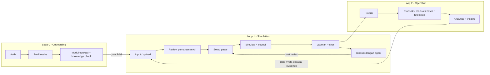

# Workflow Aplikasi End-to-End

Dokumen ini mendefinisikan alur kerja aplikasi dari sisi pengguna dan sistem: urutan layar, gate, state, event, dan pemetaannya ke kontrak API serta requirement tetap. Dokumen ini adalah jembatan antara [kontrak API](06-api-contract.md) dan [rencana UI/mock](13-ui-system-and-mock-plan.md).

Dokumen ini tidak mendefinisikan visual. Visual, komponen, dan rencana mock ada di dokumen 13.

## Prinsip workflow

1. **Setiap langkah menghasilkan artifact yang dapat diperiksa pengguna.** Tidak ada langkah black-box yang langsung melompat ke hasil.
2. **Pengguna selalu mengonfirmasi pemahaman AI sebelum komputasi mahal dijalankan.** Ekstraksi dokumen dan OCR struk keduanya menghasilkan draft, bukan fakta.
3. **Progress mencerminkan state pipeline nyata**, bukan timer atau animasi palsu. Turunan langsung dari state machine di [arsitektur sistem](02-system-architecture.md).
4. **Kegagalan parsial adalah jalur workflow kelas satu**, bukan error page. `partial` punya layar sendiri.
5. **Angka hanya mengalir satu arah**: deterministic engine → artifact → UI. Tidak ada layar yang menghitung ulang atau meminta LLM mengisi angka kosong.

## Peta area aplikasi

Aplikasi terdiri dari tiga loop yang saling memberi makan, bukan satu wizard linear.



Loop 2 menutup umpan balik: transaksi nyata yang sudah dikonfirmasi menjadi evidence tambahan berkualitas tinggi untuk run berikutnya. Ini yang membedakan produk dari kalkulator sekali pakai, dan wajib terlihat pada demo (lihat narasi demo di [roadmap](09-mvp-roadmap.md)).

## Journey utama: Loop 1

| # | Layar | State analysis | Endpoint utama | Requirement |
|---|---|---|---|---|
| S0 | Dashboard / riwayat | — | `GET /v1/dashboard`, `GET /v1/analyses` | F-02 |
| S1 | Upload Dokumen | `draft` | `POST /v1/business-profile/extractions` | F-03 |
| S2 | Analisis AI (ekstraksi) | `extracting` | SSE ekstraksi | F-03 |
| S3 | Review Bisnis | `draft` | `PUT /v1/business-profile` | F-03, F-09 gate |
| S4 | Setup Pasar | `draft` | `POST /v1/analyses` | F-03, F-04, F-05 |
| S5 | Simulasi (live) | `queued`→`validating_report` | `GET /v1/analyses/{id}/events` | F-04, F-05, F-06 |
| S6 | Laporan | `completed` \| `partial` | `GET /v1/analyses/{id}/report` | F-06, F-07, F-13, F-16 |
| S7 | Diskusi | `completed` \| `partial` | `POST /v1/analyses/{id}/discussions` | F-07 |
| S8 | Perbandingan | — | `POST /v1/analyses/compare` | F-14 |

S1–S2 bersifat opsional. Pengguna dapat melompat langsung ke S3 dan mengisi manual. Upload adalah akselerator, bukan syarat.

### Rekonsiliasi: upload-first vs kontrak terstruktur

Kontrak `POST /v1/analyses` menuntut field terstruktur (`business_type`, `location`, `pricing`, `operations`). Alur berbasis upload dokumen tidak menggantikan kontrak itu; alur tersebut **mengisi kontrak itu terlebih dahulu**, lalu meminta konfirmasi manusia.

```text
dokumen (PDF/DOCX/MD/TXT/foto)
  -> ekstraksi terstruktur (LangChain structured output)
  -> BusinessProfileDraft dengan field confidence
  -> layar Review Bisnis (S3)
  -> konfirmasi pengguna
  -> BusinessProfile tervalidasi
  -> payload POST /v1/analyses
```

Konsekuensi teknis yang mengikat:

- Ekstraksi **tidak pernah** menghasilkan angka finansial otoritatif. Ekstraksi hanya boleh menyalin angka yang tertulis di dokumen, dengan `source_span` (halaman/offset) sebagai bukti.
- Setiap field draft punya salah satu dari tiga status: `detected`, `needs_confirmation`, `missing`. Status ini yang dirender sebagai badge pada layar S3.
- Field `missing` yang termasuk input finansial minimum (lihat [data & scoring](05-data-evidence-and-scoring.md)) **memblokir** tampilan BEP sebagai angka presisi. Analysis tetap boleh berjalan, tetapi dimensi terkait diberi confidence rendah dan report menampilkan checklist data kurang.
- Teks dokumen diperlakukan sebagai untrusted data dan didelimit, sesuai ancaman prompt injection di [security](07-security-privacy-ai-safety.md).

### S1 — Upload Dokumen

**Tujuan.** Menurunkan biaya input awal dari "isi 15 field" menjadi "unggah proposal yang sudah kamu punya".

| Aspek | Ketentuan |
|---|---|
| Format diterima | PDF, DOCX, MD, TXT, JPG/PNG (business plan hasil foto) |
| Batas | 10 MB/file, maksimum 5 file per draft |
| Validasi | MIME via magic bytes, bukan extension; pixel count untuk image |
| Alternatif | Tombol "Isi manual" dan "Pakai contoh" (contoh = fixture demo) |
| Empty state | Tiga kartu contoh dokumen agar pengguna tahu bentuk input yang baik |
| Privasi | Objek privat, retention terpisah, dihapus saat akun dihapus |

**Error yang harus ditangani:** file rusak, PDF hasil scan tanpa text layer (fallback ke OCR), dokumen terlalu pendek untuk diekstrak, format tak didukung, kuota habis.

### S2 — Analisis AI (ekstraksi)

Layar transisi berdurasi pendek (target p50 < 12 detik). Menampilkan sub-stage nyata:

```text
membaca_dokumen -> memecah_konten -> mengekstrak_entitas
  -> memetakan_ke_skema -> menilai_kelengkapan -> siap_direview
```

Bila ekstraksi gagal total, pengguna tidak dikembalikan ke nol: sistem membuka S3 dalam keadaan kosong dengan pesan jujur bahwa ekstraksi gagal dan input manual tetap tersedia.

### S3 — Review Bisnis ("Cek Ringkasan Bisnis")

Layar terpenting dalam loop. Di sinilah kontrol manusia atas pemahaman AI ditegakkan.

Empat kartu wajib, masing-masing dengan status badge:

| Kartu | Isi | Sumber |
|---|---|---|
| Ringkasan Usaha | nama ide, jenis bisnis (taxonomy), deskripsi, USP | ekstraksi/manual |
| Target Pelanggan | segmen, lokasi + radius, kebiasaan | ekstraksi/manual |
| Produk & Harga | produk utama, varian, range harga | ekstraksi/manual |
| Asumsi Finansial | modal awal, biaya operasional bulanan, HPP, target volume | ekstraksi/manual |
| Kompetitor Terdekat | daftar kompetitor terdeteksi + tambah manual | evidence adapter + input |

Aturan:

- Setiap field dapat diedit inline. Edit menaikkan status ke `confirmed` dan mencatat `edited_by_user: true` pada snapshot input.
- Kartu dengan status `missing` pada field wajib finansial ditandai `Perlu dilengkapi` dan memicu CTA sekunder "Lengkapi Data yang Kurang".
- Tombol primer "Lanjut ke Simulasi Pasar" tetap aktif meski ada data kurang, tetapi menampilkan konfirmasi yang menyebutkan konsekuensi persis: dimensi mana yang tidak dapat diskor dan angka mana yang akan tampil sebagai range.
- Kompetitor yang berasal dari evidence adapter menampilkan sumber dan `observed_at`. Kompetitor tambahan dari pengguna diberi label `user_reported` dan tidak boleh dihitung sebagai evidence berkualitas sama.

**Gate edukasi (F-09) dievaluasi di akhir layar ini.** Bila modul relevan belum selesai, tombol lanjut berubah menjadi "Selesaikan Modul Dulu" dengan daftar modul yang kurang dan estimasi waktu. Gate memanggil `GET /v1/education/prerequisites` dengan konteks profil yang baru dikonfirmasi — bukan profil lama — karena jenis usaha bisa berubah di layar ini.

### S4 — Setup Pasar

Melengkapi field yang tidak ada di dokumen tetapi wajib bagi kontrak analysis:

- titik/area target dinormalisasi ke hierarchy Jabodetabek + `analysis_radius_m`;
- jam operasi dan channel;
- `volume_units_day` sebagai range `{min, base, max}` — bukan satu angka, karena Finance Council membutuhkan bound;
- kapasitas harian dan hari operasi per bulan;
- toggle scope simulasi: ukuran cohort (12/16/24) dan jumlah round.

Layar ini menampilkan **pratinjau evidence sebelum run**: jumlah kompetitor terdeteksi pada radius terpilih, freshness data, dan daftar field yang tidak tersedia. Pengguna melihat kualitas data *sebelum* menghabiskan waktu simulasi. Bila `evidence_confidence` pratinjau di bawah 0.50, CTA lanjut diberi peringatan dan saran pengumpulan data, sesuai perilaku UI di [data & scoring](05-data-evidence-and-scoring.md).

Submit memanggil `POST /v1/analyses` dengan `Idempotency-Key` dari draft ID, sehingga double-click atau reconnect tidak membuat dua run.

### S5 — Simulasi (live)

Layar ini adalah bukti teknis utama produk. Ia tidak boleh berupa spinner.

**Sumber kebenaran:** `GET /v1/analyses/{id}/events` (SSE), fallback polling `GET /v1/analyses/{id}` tiap 3 detik bila SSE gagal.

Pemetaan stage ke tampilan:

| State | Judul yang ditampilkan | Yang terlihat bergerak |
|---|---|---|
| `queued` | Menyiapkan run | posisi antrean |
| `collecting_evidence` | Mengumpulkan bukti lokal | daftar sumber + status per sumber |
| `building_context` | Menyusun konteks | concept card final yang dilihat semua persona |
| `simulating` | Panel persona berjalan | feed interaksi + progres round |
| `calculating_finance` | Menghitung skenario | tiga skenario mengisi tabel |
| `scoring` | Menilai kelayakan | dimensi terisi satu per satu |
| `composing_report` | Menyusun laporan | draft → kritik → revisi |
| `validating_report` | Memvalidasi klaim | jumlah klaim tervalidasi/ditolak |

**Persentase** berasal dari weighted stage completion yang dikirim backend, tidak pernah dihitung frontend.

**Kontrak event minimum:**

```json
{
  "event": "stage_changed",
  "run_id": "uuid",
  "stage": "simulating",
  "percent": 45,
  "message": "Panel persona sedang mengevaluasi skenario",
  "at": "2026-08-05T08:01:12Z"
}
```

```json
{
  "event": "agent_action",
  "run_id": "uuid",
  "round": 1,
  "council": "customer_persona",
  "agent_id": "persona-budget-01",
  "archetype": "budget_driven",
  "action": "create_comment",
  "target_id": "post-concept-a",
  "summary": "Harga Rp25.000 di atas batas nyaman saya untuk kopi harian",
  "at": "2026-08-05T08:01:14Z"
}
```

```json
{
  "event": "artifact_ready",
  "run_id": "uuid",
  "artifact": "MarketAssessment",
  "artifact_id": "uuid",
  "council": "market_analyst"
}
```

Frontend hanya merender event. Ia tidak menyimpulkan, tidak menghitung agregat, dan tidak menebak stage berikutnya.

**Pengguna dapat membatalkan** run yang berjalan. Cancel mengirim `POST /v1/analyses/{id}/cancel`, memindahkan state ke `cancelled`, dan tetap menyimpan artifact yang sudah selesai untuk audit.

### Workflow deliberasi yang terlihat pengguna

Protokol empat round dari [protokol simulasi](04-simulation-protocol.md) dipetakan ke tiga tampilan yang dapat ditukar pengguna, bukan satu daftar log:

| Round | Yang terjadi | Yang ditampilkan |
|---|---|---|
| 0 | Baseline private via `INTERVIEW` manual | grid posisi awal per persona, belum saling melihat |
| 1 | Exposure ke concept card | feed komentar/like/dislike/purchase |
| 2 | Interaksi antarpersona | thread balasan, indikator perubahan posisi |
| 3 | Controlled intervention (satu variabel) | panel sebelum/sesudah dengan delta |
| final | Ballot terstruktur | distribusi jawaban + disagreement |

Market, Finance, dan Report Council punya bentuk tampilan berbeda karena interaksinya bukan sosial melainkan argumentatif: klaim → tantangan → revisi. Tampilan mereka adalah thread berpasangan (`challenge_claim` selalu merujuk `claim_id`), bukan feed.

**Batas kejujuran yang wajib ditegakkan di layar ini:** setiap kutipan persona diberi label respons sintetis, tidak memakai nama orang nyata, dan tidak pernah disajikan sebagai kutipan pelanggan sungguhan.

### S6 — Laporan

Struktur bagian bernomor, urutan tetap:

```text
01 Launch Readiness Score        skor + interpretasi + rule_version
02 Evidence Confidence           skor + label + daftar missing evidence
03 Executive Summary             narasi + parameter yang dipahami AI
04 Analisis Pasar & Kompetitor   saturasi, daya saing harga, catatan
05 Proyeksi Finansial            tiga skenario + BEP + asumsi included/excluded
06 Peta Risiko                   risiko + mitigasi, masing-masing bertaut artifact
07 Rekomendasi Prioritas         checklist 30 hari
08 Bukti & Keterbatasan          tabel evidence + limitations + disclaimer
```

Bagian 02 dan 08 **tidak boleh dihilangkan atau di-collapse secara default**. Keduanya adalah pemenuhan F-16 dan aturan provenance. Mock awal yang hanya menampilkan skor tanpa keduanya tidak lolos definition of done.

Aturan tambahan:

- Setiap angka menampilkan satuan dan dapat di-hover/tap untuk melihat sumber, `observed_at`, dan confidence.
- Skor dan confidence tampil berdampingan, tidak saling mengubah.
- Setiap rekomendasi menunjuk artifact ID; rekomendasi tanpa taut tidak dirender.
- Status `partial` mengubah header laporan, bukan menyembunyikannya (lihat bagian kegagalan).
- Aksi: Unduh PDF (`POST /v1/analyses/{id}/exports`), Simpan ke Riwayat, Buat Variasi, Tanya AI.

### S7 — Diskusi dengan agent

Percakapan lanjutan terhadap run yang sudah selesai. Pengguna memilih spesialis (Pakar Pemasaran, Ahli Finansial, Analis Risiko) yang merupakan personality instance dari council terkait, bukan chatbot generik.

Batas yang mengikat:

- Agent hanya boleh membaca artifact run ini. Tidak ada akses ke transaksi mentah, secret, atau data user lain.
- Agent **tidak boleh menghasilkan angka baru**. Bila pertanyaan menuntut hitungan (misalnya efek promo "Beli 1 Gratis 1" terhadap margin), agent memanggil deterministic finance calculator dan mengutip hasilnya. Angka tanpa `tool_call_id` ditolak validator sebelum dirender.
- Jawaban yang mengubah asumsi menawarkan aksi terstruktur: "Jalankan sebagai variasi" yang membawa parameter ke S4, bukan sekadar teks.
- Riwayat diskusi tersimpan per run dan masuk audit event.

### S8 — Variasi dan perbandingan

"Buat Variasi" menyalin seluruh input run asal, mengunci `cohort_version`, prompt version, model config, dan seed, lalu membuka S4 dengan satu field disorot untuk diubah. Ini menegakkan aturan counterfactual: satu variabel berubah, sisanya identik.

Layar perbandingan menampilkan delta **berdampingan dengan run-to-run variability**. Bila delta lebih kecil dari variability atau confidence rendah, UI wajib menyatakan bahwa perbedaan tidak dapat disimpulkan — tidak boleh menampilkan pemenang.

## Loop 2 — Operation

### Transaksi

Tiga jalur input, satu tujuan akhir:

| Jalur | Layar | Endpoint | Karakter |
|---|---|---|---|
| Manual | form cepat, produk sebagai chip | `POST /v1/transactions` | target < 10 detik per transaksi |
| Batch | tabel dapat ditempel dari spreadsheet | `POST /v1/transactions/batch` | validasi per baris, tolak parsial dilaporkan |
| Foto struk | kamera/upload → review → commit | `/v1/receipt-imports/*` | selalu melewati review |

### Workflow foto struk

```text
created -> uploading -> queued -> preprocessing -> extracting
  -> ready_for_review -> confirmed -> committed
  | failed | cancelled
```

Layar review adalah kembaran konseptual dari S3: draft hasil mesin, field confidence, koreksi manusia, baru commit. Ketentuan UI:

- Field dengan confidence rendah disorot dan mendapat fokus pertama.
- Item dapat dicocokkan ke master produk; item tak dikenal menawarkan "buat produk baru".
- Mismatch antara `sum(quantity * unit_price)` dan total wajib dikonfirmasi eksplisit, tidak boleh diperbaiki diam-diam.
- Gambar struk tampil berdampingan dengan form agar koreksi tidak perlu mengingat.

### Analytics dan insight

`GET /v1/transaction-analytics`. Aturan tampilan:

- Setiap insight menyebut observation window secara eksplisit.
- Sebelum 7 hari data, tren tidak ditampilkan; yang muncul adalah progress pengumpulan data.
- Produk dengan exposure di bawah minimum tidak masuk daftar terlaris/terendah, dan alasannya dinyatakan.
- Tidak ada rekomendasi "hapus produk" berdasarkan volume saja.

## Kegagalan, kosong, dan degradasi

Setiap layar wajib mendefinisikan lima state, sesuai definition of done di [roadmap](09-mvp-roadmap.md).

| State | Perilaku wajib |
|---|---|
| Loading | skeleton yang menyerupai bentuk akhir, bukan spinner penuh layar |
| Empty | menjelaskan apa yang akan muncul + satu aksi utama |
| Error | pesan aman, `correlation_id` dapat disalin, aksi retry bila `retryable: true` |
| Unauthorized | arahkan login tanpa kehilangan draft yang sedang diisi |
| Partial | lihat di bawah |

### Perilaku `partial`

`partial` terjadi bila deterministic report tersedia tetapi komponen non-esensial gagal, umumnya OASIS atau PDF.

Yang wajib dilakukan UI:

1. Header laporan menyatakan status parsial dengan alasan yang aman dan spesifik ("simulasi persona tidak tersedia"), bukan "terjadi kesalahan".
2. Bagian yang gagal dirender sebagai bagian berstatus `unavailable`, tetap pada posisinya, tidak dihapus dari daftar isi.
3. Skor **tidak** diberi nilai default untuk komponen yang gagal. Dimensi terkait ditandai tidak dapat dinilai dan bobotnya dinyatakan.
4. Confidence turun sesuai rule dan perubahannya dijelaskan.
5. Tombol "Coba lagi tahap simulasi" hanya mengulang stage tersebut dengan idempotency control.
6. PDF hasil export dari run parsial memuat penanda parsial yang sama.

Menyamarkan `partial` menjadi `completed` adalah pelanggaran kontrak, bukan pilihan desain.

## Traceability layar ↔ requirement

| Requirement | Layar pemenuhan |
|---|---|
| F-01 | Auth, session guard di seluruh route |
| F-02 | Dashboard, riwayat analysis, ringkasan transaksi |
| F-03 | S1–S4 |
| F-04 | S5 (evidence + market council), S6 bagian 04 |
| F-05 | S5, S6 bagian 04 dan 05 |
| F-06 | S6 bagian 01 |
| F-07 | S6 keseluruhan |
| F-08 | Modul edukasi |
| F-09 | Gate di akhir S3 |
| F-10 | Input transaksi manual dan batch |
| F-10A | Upload struk + layar review OCR |
| F-11 | Analytics dengan observation window |
| F-12 | Kartu insight rule-based |
| F-13 | Export PDF analysis dan transaksi |
| F-14 | S8 perbandingan |
| F-15 | Area admin terpisah |
| F-16 | S6 bagian 08 dan footer setiap export |

## Telemetri per layar

Minimal yang dicatat agar SUS dan perbaikan UX punya dasar:

- waktu di S3 dan jumlah field yang diedit pengguna (mengukur kualitas ekstraksi);
- rasio pengguna yang menekan "Lengkapi Data yang Kurang" versus melanjutkan;
- drop-off per stage di S5 dan durasi per stage;
- rasio run `completed` / `partial` / `failed`;
- pemakaian S7 dan jenis pertanyaan;
- waktu input per transaksi manual dan rasio koreksi field pada review OCR.

Telemetri tidak boleh memuat isi dokumen, isi struk, atau teks bebas pengguna.
